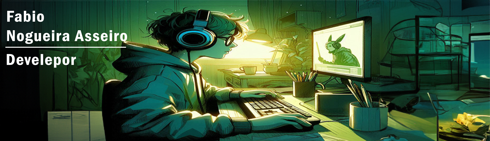

#

   
  
  

### Contact me

## Tecnologias que uso no meu dia

## Tecnologias que quero aprender

 
    
    
    

### Sobre mim

Tenho 19 anos e me chamo Fábio Nogueira Asseiro. Resido na cidade de Osasco, São Paulo. Atualmente, estou cursando o terceiro semestre de Análise e Desenvolvimento de Sistemas na Faculdade São Judas, onde estou focado em aprimorar meus conhecimentos e habilidades na área de Tecnologia da Informação.
